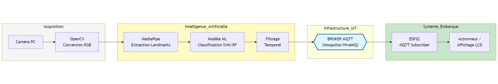
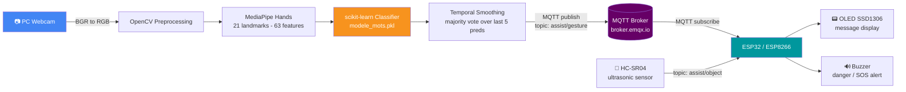
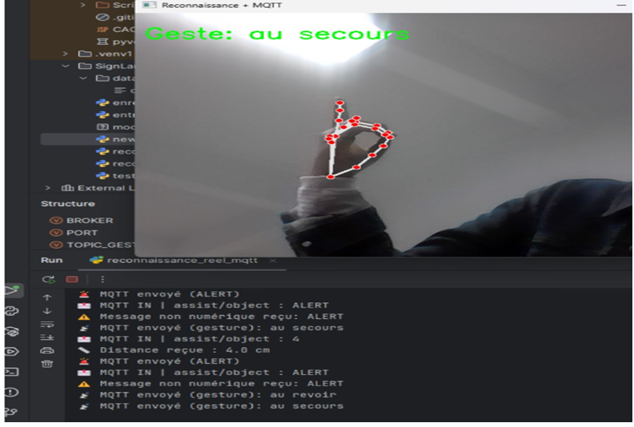
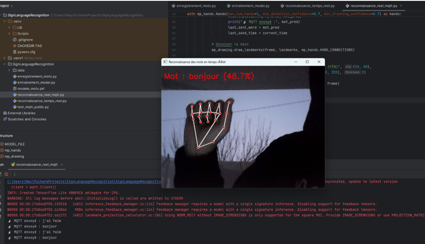
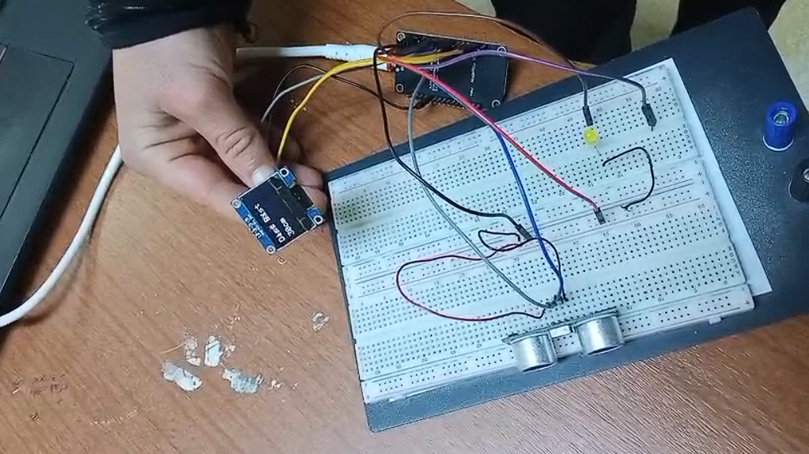

<div align="center">

# 🤟 IA Gesture

**Real-time hand-gesture recognition system that translates sign gestures into readable messages, with an IoT-connected embedded assistant for accessibility and safety.**

[](LICENSE)
[](requirements.txt)
[](https://opencv.org)
[](https://developers.google.com/mediapipe)
[](https://scikit-learn.org)
[](https://mqtt.org)
[](firmware/)
[](docs/architecture.md)
[](docs/rapport_IA_Gesture.pdf)


</div>



---

## 📖 Table of Contents

- [Project Overview](#-project-overview)
- [Features](#-features)
- [Architecture](#-architecture)
- [Technologies](#-technologies)
- [Demo](#-demo)
- [Repository Structure](#-repository-structure)
- [Installation](#-installation)
- [Usage](#-usage)
- [Hardware](#-hardware)
- [AI Model](#-ai-model)
- [MQTT Communication](#-mqtt-communication)
- [Performance](#-performance)
- [Results](#-results)
- [Skills Demonstrated](#-skills-demonstrated)
- [Future Improvements](#-future-improvements)
- [Repository Highlights](#-repository-highlights)
- [Authors](#-authors)
- [Acknowledgements](#-acknowledgements)
- [License](#-license)

---

## 🧭 Project Overview

**IA Gesture** is an accessibility-focused assistive system designed to help
**non-verbal, hearing-impaired, and visually-impaired people** communicate
more easily and stay safer in their daily environment.

A standard PC webcam captures the user's hand gestures. On the software
side, **MediaPipe** extracts 21 3D hand landmarks per frame, which are fed
into a **machine learning classifier** trained to recognize a predefined
set of signs (e.g. *Hello*, *Yes*, *No*, *Thanks*, *Help*). The recognized
gesture is smoothed over a short history window, then published over
**MQTT** to an **ESP32/ESP8266** microcontroller, which displays the
translated message on an **OLED screen** and can trigger a **buzzer alert**
in emergency situations — with an **ultrasonic sensor** providing basic
obstacle/distance awareness.

The project was built end-to-end by a 5-person student team: computer
vision & ML pipeline, MQTT-based IoT communication layer, embedded
firmware, and a Proteus-designed circuit — documented in full in the
[project report](docs/rapport_IA_Gesture.pdf).

## ✨ Features

- 🖐️ **Real-time hand tracking** using MediaPipe Hands (21 3D landmarks per hand).
- 🧠 **Gesture classification** via a scikit-learn model trained on predefined signs (e.g. Hello, Yes, No, Thanks, Help).
- 📶 **Wireless communication** between the PC and the embedded device over MQTT (lightweight, low-latency, IoT-standard).
- 📟 **OLED feedback** — translated messages are displayed live on an SSD1306 screen.
- 🚨 **Safety mode** — ultrasonic distance sensing + buzzer alerts for danger/SOS situations.
- 🎛️ **Multiple operating modes** on the embedded device: *Non-Verbal*, *Aveugle* (visually-impaired assistance), and *SOS*.
- 🧪 **Temporal smoothing** — majority-vote filtering over recent predictions to reduce jitter/noise.

## 🏗 Architecture

```
Camera (PC) → OpenCV + MediaPipe (landmarks) → ML model (gesture classification)
            → MQTT (broker.emqx.io) → ESP32 / ESP8266 → OLED + Buzzer + Ultrasonic sensor
```

### System flow



Full breakdown, diagrams (bête à cornes, diagramme pieuvre, use-case) and
component tables are in [`docs/architecture.md`](docs/architecture.md).

## 🧰 Technologies

| Domain | Stack |
|---|---|
| Computer vision | [OpenCV](https://opencv.org), [MediaPipe](https://developers.google.com/mediapipe) |
| Machine learning | [scikit-learn](https://scikit-learn.org) |
| Messaging / IoT | [MQTT](https://mqtt.org) via [paho-mqtt](https://pypi.org/project/paho-mqtt/), broker: [EMQX](https://www.emqx.io) |
| Embedded firmware | Arduino (ESP32 / ESP8266), `PubSubClient`, `Adafruit_SSD1306` |
| Hardware design | [Proteus](https://www.labcenter.com/) |
| Language | Python 3, C++ (Arduino) |

## 🎬 Demo

<div align="center">

**🔗 LinkedIn demo post:** https://www.linkedin.com/posts/ugcPost-7426374563237818370-LGAR/?utm_source=share&utm_medium=member_desktop&rcm=ACoAAEyPdjUBMWvfSD5oRdK4eutkuw1UHI3semA
*(a local video demo will be added to `assets/demo.mp4` in a future update)*

</div>

| Gesture detection (PC) | MQTT message flow |
|---|---|
|  |  |

| Hardware montage |
|---|
|  |

## 📂 Repository Structure

```
IA-Gesture/
│
├── README.md
├── LICENSE
├── .gitignore
├── requirements.txt
│
├── assets/                        # Images used in README / documentation
│   ├── architecture.png
│   ├── demo.mp4                   # ⬅ add your demo video here
│   ├── images/                    # Component reference photos, dev-tool icons
│   └── screenshots/                # App & hardware demo screenshots
│
├── docs/
│   ├── rapport_IA_Gesture.pdf     # Full project report (French)
│   ├── architecture.md            # Architecture summary (this repo's docs)
│   └── diagrams/                  # Functional-analysis diagrams (bête à cornes, pieuvre, use-case...)
│
├── src/                            # PC-side source code (Python)
│   ├── gesture_recognition/
│   │   └── handgestures.py        # Main script: capture → MediaPipe → classification → MQTT publish
│   ├── mqtt/                       # MQTT logic reference (currently inline, see README inside)
│   ├── training/
│   │   └── collect_dataset.py     # Dataset collection script (webcam capture per gesture label)
│   ├── utils/                      # Reserved for shared helpers (future refactor)
│   └── models/                     # Trained model (modele_mots.pkl) goes here
│
├── experiments/                    # Exploratory / superseded work, kept for reference
│   ├── old_tests/
│   ├── prototypes/                # Early approaches (ASL/TensorFlow idea, finger counting, two-hand test)
│   └── notebooks/
│
├── firmware/                       # Embedded (Arduino) code
│   ├── gesture_assistant/
│   │   └── gesture_assistant.ino  # Final firmware (Non-Verbal / Aveugle / SOS modes)
│   └── tests/                      # Intermediate validation sketches (OLED, MQTT, blink)
│
├── hardware/
│   ├── pcb/                        # Reserved for PCB design files
│   ├── schematic/                  # Reserved for exported schematic files
│   ├── proteus/                    # Proteus circuit project
│   └── 3d/                         # Enclosure renders / wiring diagrams
│
└── dataset/
    ├── raw/                        # Raw captured images per gesture label
    └── processed/                  # Processed landmark dataset used for training
```

## ⚙️ Installation

### PC / AI side

```bash
git clone https://github.com/YOUR-USERNAME/IA-Gesture.git
cd IA-Gesture
pip install -r requirements.txt
```

Place your trained model as `src/models/modele_mots.pkl` (see
[`src/models/README.md`](src/models/README.md)).

### Embedded side

1. Open `firmware/gesture_assistant/gesture_assistant.ino` in the Arduino IDE.
2. Install the required libraries: `PubSubClient`, `Adafruit_GFX`, `Adafruit_SSD1306`.
3. Update the Wi-Fi credentials (`ssid` / `password`) in the sketch.
4. Select an ESP8266 board and upload.

## ▶️ Usage

```bash
cd src/gesture_recognition
python handgestures.py
```

1. The script opens the webcam feed and detects the hand in real time.
2. Recognized gestures are smoothed over a short history window and published to the MQTT topic `assist/gesture`.
3. The ESP8266 receives the message and displays it on the OLED screen, triggering the buzzer for danger/SOS states.
4. Press `q` in the video window to quit.

To (re)build your own gesture dataset:

```bash
cd src/training
python collect_dataset.py
```

## 🔌 Hardware

### Bill of materials

| Component | Reference | Interface | Role | Why this choice |
|---|---|---|---|---|
| Microcontroller | ESP32 / ESP8266 | Wi-Fi / I²C | Processing, MQTT, sensor/actuator management | Built-in Wi-Fi, low power, native MQTT support |
| Display | OLED SSD1306 | I²C | Displays translated messages and alerts | Low power, high contrast, compact |
| Distance sensor | HC-SR04 (ultrasonic) | GPIO | Obstacle/distance safety assistance | Accurate, low cost, industry-standard |
| Buzzer | Active | GPIO | Audible danger/SOS alerts | Simple to drive, immediate feedback |
| Power | 5V / USB | — | System power supply | Widely available, plug-and-play |

### Platforms evaluated before the final design

| Platform | Pros | Cons | Verdict |
|---|---|---|---|
| ESP32-CAM | Low cost, compact, integrated camera | Flashing/upload instability, limited processing power, insufficient image quality | ❌ Rejected |
| Raspberry Pi + USB camera | High compute power for CV/ML | Higher cost, power draw, setup complexity | ❌ Rejected |
| **PC camera + ESP32/ESP8266** | Stable, high performance, cost-efficient, upgrade path to smartphone camera | Depends on a PC for inference | ✅ **Selected** |

Reference photos: `assets/images/esp32-cam.png`, `assets/images/raspberry-pi-usb-camera.png`
See [`docs/architecture.md`](docs/architecture.md) for the full comparison and rationale.

Circuit schematic: `hardware/proteus/gesture_assistant_schematic.pdsprj`
Enclosure design references: `hardware/3d/`

## 🧠 AI Model

- **Input:** 63-value feature vector — the (x, y, z) coordinates of MediaPipe's 21 hand landmarks, concatenated.
- **Classifier:** scikit-learn model trained offline on a labeled gesture dataset (`predict_proba` used for confidence scoring).
- **Stabilization:** the last 5 predictions are kept in a rolling history; the majority class is selected as the final output, reducing flicker from noisy single-frame predictions.
- **Dataset collection:** `src/training/collect_dataset.py` captures labeled images per gesture (`hello`, `thanks`, `yes`, `no`, `peace`, ...).
- Early prototyping also explored a TensorFlow/Keras ASL-alphabet CNN approach and a convexity-defects finger-counting approach — both kept for reference in [`experiments/prototypes/`](experiments/prototypes/).

## 📡 MQTT Communication

| | |
|---|---|
| Broker | `broker.emqx.io` |
| Topic (PC → device) | `assist/gesture` — recognized gesture/word |
| Topic (device ↔ PC) | `assist/object` — distance readings / danger alerts |
| Protocol | MQTT v3.1.1, publish/subscribe |

The PC acts as **publisher**, the ESP32/ESP8266 acts as **subscriber**
(and also publishes distance data back). See
[`src/mqtt/README.md`](src/mqtt/README.md) for where this logic currently
lives in the codebase.

## 📊 Performance

| Aspect | Observation |
|---|---|
| Communication latency | Low latency observed between gesture recognition and OLED display, validated via MQTT Explorer message traces (`assets/screenshots/mqtt-explorer-messages.png`) |
| Prediction stability | Majority-vote smoothing over the last 5 predictions reduces single-frame misclassification/jitter |
| Sensitivity | Recognition accuracy depends on lighting conditions and gesture speed (see [Discussion & limits](docs/rapport_IA_Gesture.pdf), chapter 4.11) |
| Communication reliability | Stable MQTT publish/subscribe behavior confirmed during functional validation (chapter 5.9 of the report) |

> Detailed quantitative benchmarks (accuracy %, response time in ms) were
> not part of the original project files; the observations above reflect
> the qualitative validation documented in the report. Contributions
> adding measured benchmarks are welcome — see
> [Future Improvements](#-future-improvements).

## 🏁 Results

- ✅ End-to-end pipeline working: webcam → hand landmarks → gesture classification → MQTT → OLED display.
- ✅ Multiple embedded operating modes implemented: *Non-Verbal*, *Aveugle* (visually-impaired assistance), *SOS*.
- ✅ Real-time feedback loop validated with MQTT Explorer (topic traces in `assets/screenshots/`).
- ✅ Functional prototype assembled and tested on breadboard, with a 3D-modeled enclosure concept (`hardware/3d/`).
- ✅ Full functional analysis delivered (bête à cornes, diagramme pieuvre, use-case diagrams — `docs/diagrams/`).

See [`docs/rapport_IA_Gesture.pdf`](docs/rapport_IA_Gesture.pdf) for the complete write-up, validation methodology, and results discussion.

## 🎯 Skills Demonstrated

- **Computer vision:** real-time hand tracking and landmark extraction with MediaPipe/OpenCV.
- **Machine learning:** feature engineering (landmark vectors), model training and inference with scikit-learn, prediction smoothing/stabilization.
- **Embedded systems:** ESP32/ESP8266 firmware development in Arduino/C++, I²C peripheral integration (OLED), GPIO sensor/actuator control.
- **IoT & networking:** MQTT publish/subscribe architecture design across a PC↔microcontroller link.
- **Hardware design:** circuit schematic design in Proteus, enclosure planning, component selection with documented trade-off analysis.
- **Systems/requirements engineering:** structured functional analysis (bête à cornes, diagramme pieuvre, use-case modeling).
- **Project & documentation skills:** end-to-end technical report writing, structured open-source repository organization, team collaboration (5-person student team).
- **Accessibility-driven design:** building assistive technology centered on real user needs (non-verbal, hearing- and visually-impaired users).

## 🚀 Future Improvements

- 📱 Integrate a smartphone camera to remove the PC dependency (streaming or on-device MediaPipe + MQTT).
- 🗂️ Expand the gesture dataset and add dynamic (motion-based) gestures.
- ☁️ Move inference to the cloud for scalability and remote model updates.
- 📍 Add GPS tracking for enhanced user safety.
- 🖨️ Design a dedicated PCB to replace the breadboard prototype.
- 🧩 Extract MQTT logic and helper functions into standalone modules (`src/mqtt/`, `src/utils/`) for better testability.
- 📈 Add quantitative benchmarking (accuracy, latency, confusion matrix) with results published in the [Performance](#-performance) section.
- 🧪 Add automated tests and a CI pipeline for the Python codebase.
- 🌐 Explore additional use cases: elderly assistance, interactive education, smart security systems (see report, chapter 6.7).

Full discussion in [`docs/rapport_IA_Gesture.pdf`](docs/rapport_IA_Gesture.pdf) (Chapter 6).

## 🌟 Repository Highlights

- 📘 **Fully documented** with a complete academic report (`docs/rapport_IA_Gesture.pdf`) plus a condensed [architecture summary](docs/architecture.md).
- 🗂️ **Clean, professional structure** separating production code (`src/`, `firmware/`), exploratory work (`experiments/`), hardware assets (`hardware/`), and data (`dataset/`).
- 🧪 **Development history preserved** — early prototypes and intermediate firmware test sketches are kept (not deleted) for transparency and learning value.
- 🖼️ **Visual documentation** — functional-analysis diagrams, architecture diagrams, and real hardware/software screenshots extracted directly from the project report.
- 🔓 **Open source** under the MIT License, ready for reuse, extension, or academic reference.


## 📄 License

This project is licensed under the [MIT License](LICENSE).
